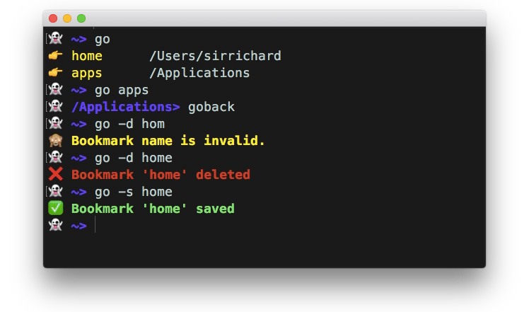
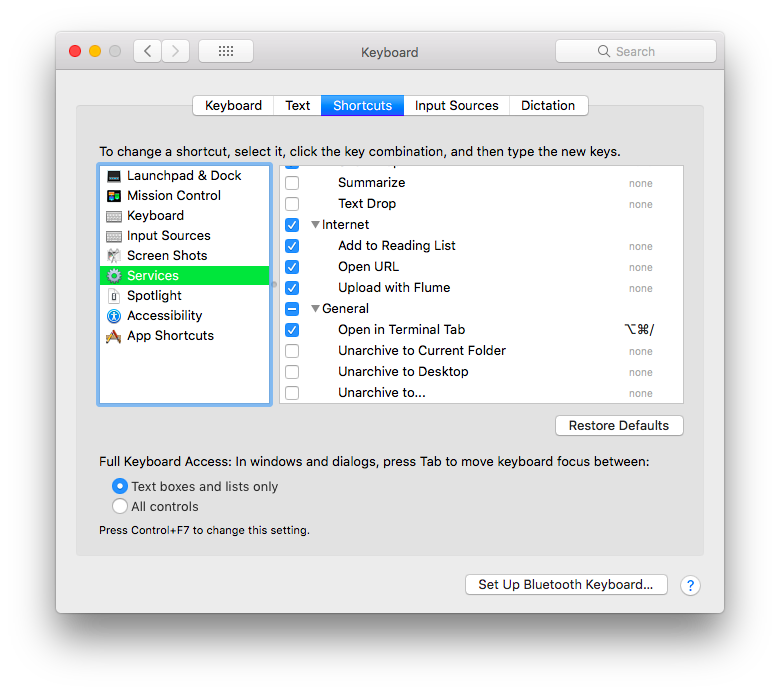

# go() command for bash
`goto-bash`
`goto-terminal`
`goto-command`
`goto-function`

####🍺 Provides bookmarking ability for folders/directories in bash.

####🍺 Open any directory inside of Finder _tab_ instead of window (macOS).

####🍺 Go to any directory or folder alias you created.

--
# Usage		

###1. Bookmarking

Go to folder, then bookmark it like so:

	go -s <bookmark name>

###2. Go to bookmark folder

When you want to go to a bookmark:

	go <bookmark name>

###3. Bookmark list
To view list of all bookmarks :
 
	go
or

	go -list

###4. Auto Completion
For using auto-completion feature, simply press [tab]:

	go app[tab]

#Installation
-
### Method 1 - Brew

	brew install goto

### Method 2 - clone
	git clone https://github.com/sirpooya/goto-bash.git goto-bash
	sudo cp goto-bash/src/goto.sh /etc/

### Method 3 - wget
	sudo wget -O /etc/goto.sh https://raw.githubusercontent.com/sirpooya/goto-bash/master/src/goto.sh

### Method 4 - Manual

Copy `Open in Terminal Tab.workflow` file to following path:

	/Users/sirrichard/Library/Services

2. 	copy it to your home folder

		sudo cp goto-bash/goto.sh ~/bin

3. source it in `.bashrc` or `.bash_profile` (or other bash startup file):

		source ~/bin/bashmarks.sh

--
# opent
`open-in-tab`

***opent*** is a simple Bash/Apple script to empower `open` command in Terminal & open current directory in Finder _Tab_ from command line on a Mac.

If you find this interesting, you should [follow me on
Twitter](https://twitter.com/copingbear) to learn about the other
things I do.
