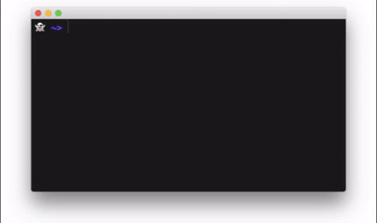

# go() command for bash
`goto-bash`
`goto-terminal`
`goto-command`
`goto-function`

####  Provides bookmarking ability for folders/directories in bash.

####  Open any directory inside of Finder _tab_ instead of window (macOS).

####  Go to any directory or folder alias you created.

# Usage		

### 1. Bookmarking

Go to folder, then bookmark it like so:

	go -s <bookmark name>

### 2. Fast Navigation

When you want to go to a bookmark:

	go <bookmark name>

### 3. Bookmark list
To view list of all bookmarks :
 
	go
or

	go -list

### 4. Auto Completion
For using auto-completion feature, simply press [tab]:

	go app[tab]

### 5. Open in Finder tab (macOS) 

You can use `opent` command instead of `open` directory in Finder _Tab_ instead of new window.
	
	opent

# Installation
-
###  Method 1 - Brew

	brew install goto

###  Method 2 - Clone
	git clone https://github.com/sirpooya/goto.git goto-bash
	sudo cp goto-bash/goto.sh /usr/local/bin

###  Method 3 - wget
	sudo wget -O /usr/local/bin/goto.sh https://raw.githubusercontent.com/sirpooya/goto-bash/master/goto.sh

###  Method 4 - Manual
1. Download and extract archive, then copy file:

		sudo cp goto-bash/goto.sh ~/bin

2. source it in `.bashrc` or `.bash_profile` (or other bash startup file):

		source ~/bin/goto.sh
		
3. make sure its executable :
	
		sudo chmod +x goto.sh
		
4. Change your `$PATH` :

        #export PATH=$PATH":$HOME/bin"
		
		

# ️ open-in-terminal service (macOS)
Using this service you can open Finder path in Terminal tab.

1. Copy `Open in Terminal Tab.workflow` file to Services folder:

		/Users/sirrichard/Library/Services

2. 	Create a shortcut for this service in Prefrences:

# 
If you find this interesting, you should [follow me on
Twitter](https://twitter.com/_pooya) or visit my [personal website](https://pooya.ml) to learn about the other
things I do.
